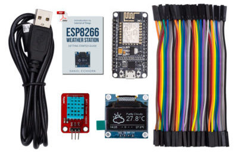

# ThingPulse ESP8266 Weather Station

This code works best with the NodeMCU V2 and an 0.96" OLED display.
To get you up and running in no time we created a kit which contains all the necessary parts including a custom PCB to connect display and WiFi chip:
[https://thingpulse.com/product/esp8266-iot-electronics-starter-kit-weatherstation-planespotter-worldclock/](https://thingpulse.com/product/esp8266-iot-electronics-starter-kit-weatherstation-planespotter-worldclock/)

By buying the kit from me us are supporting future development. Thank you!

### Build Status

| Branch  | Status |
| ------------- | ------------- |
| master  |   |
| development  |   |

## Arduino IDE

Make sure you use a version of the Arduino IDE which is supported by the ESP8266 platform. You can find it here: [https://www.arduino.cc/en/Main/OldSoftwareReleases](https://www.arduino.cc/en/Main/OldSoftwareReleases)

## Setup Arduino IDE

* Install the following libraries with your Arduino Library Manager in Sketch > Include Library > Manage Libraries...
* ESP8266 Weather Station
* JSON Streaming Parser by Daniel Eichhorn
* ESP8266 Oled Driver for SSD1306 display by Daniel Eichhorn. **Make sure that you use Version 3.0.0 or bigger!**
* Go to [https://www.wunderground.com/weather/api/](https://www.wunderground.com/weather/api/)
, create an account and get an API Key
* In the Arduino IDE go to File > Examples > ESP8266 Weather Station
* Enter  the Wunderground API Key
* Enter your Wifi credentials
* Adjust the location according to Wunderground API, e.g. Zurich, CH
* Adjust UTC offset

## Setup for PlatformIO

If you are using the PlatformIO environment for building

* choose one of the available IDE integration or the Atom based IDE
* install libraries 561, 562 and 563 with "platformio lib install"
* adapt the [WeatherStationDemo.ino](examples/WeatherStationDemo/WeatherStationDemo.ino) file to your needs (see details above)

## Upgrade

The ESP8266 Oled Library changed a lot with the latest release of version 3.0.0. We fixed many bugs and improved performance and changed the API a little bit. This means that you might have to adapt your Weather Station Code if you created it using the older 2.x.x version of the library. Either compare your code to the updated WeatherStationDemo or read through the [upgrade guide](https://github.com/ThingPulse/esp8266-oled-ssd1306/blob/master/UPGRADE-3.0.md)

## Available Modules
* **TimeClient**: simple class which uses the header date and time to set the clock
* **NTPClient**: a NTP based time class written by Fabrice Weinberg
* **WundergroundClient**: fetches current weather and forecast from wunderground.com
* **ThingspeakClient**: fetches data from Thingspeak which you might have collected with another sensor node and posted there.

## Why Weather Station as a library?

I realized that more and more the Weather Station was becoming a general framework for displaying data over WiFi to one of these pretty displays. But everyone would have different ways or sources for data and having the important part of the library would rather be the classes which fetch the data then the main class.
So if you write data fetchers which might be of interest to others please contact me to integrate them here or offer your code as extension library yourself and call it something like esp8266-weather-station-<yourservice>.
I will gladly list it here as third party library...
